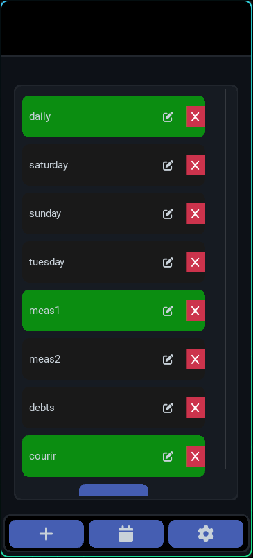
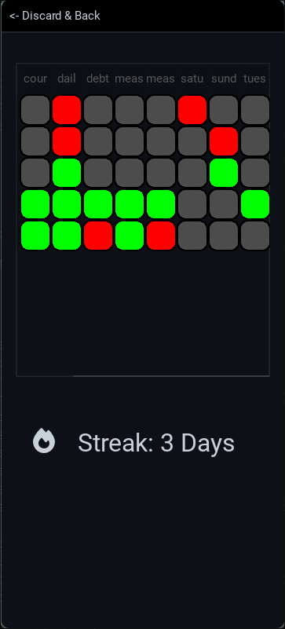
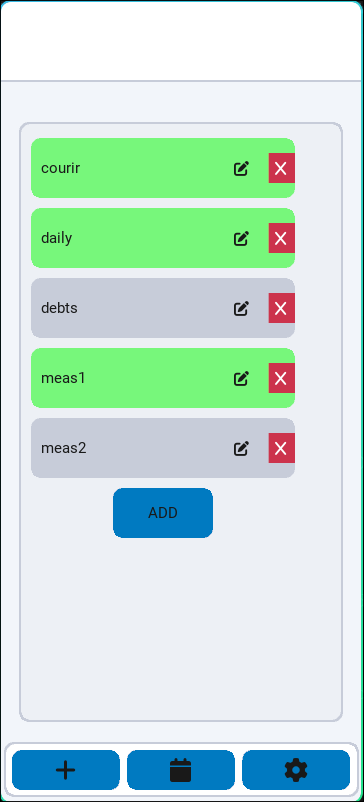

___________________________________________
# English
___________________________________________
# 📱 Habit Tracker

This project is made by Jean, currently a high school student in France (not anymore).
The goal of this app is to not forget to do your daily tasks. This app will push notifications when you should do something. You first define what you need to do and how often (daily, weekly, or monthly).

## ✅ Features

 - Add, modify and delete a habit
 - Main interface displays the habits
 - Progress view for better visualisation
 - Cross-platform: mac, windows, linux, android
 - Saves data locally
 - view your own progress!
 - Log in to your account and add friends to view their progress.


## 🛠️ Installation

### Releases

go to the linked website and install from there
https://website-for-habittracker.vercel.app/

 - Download the appropriate version from the website
 - Unzip the file
 - Navigate to *your_path*/dist
 - execute the executable from here
 - feel to create a shortcut :)

### Experimental (from the source code)

### Prerequisites

 - Python 3.10.x
 - openjdk 8 or 11
 - pip
 - Kivy
 - Buildozer (for android)

### Steps

```bash
git clone https://github.com/Jean1000levrai/Habit-Tracker.git
cd Habit-Tracker
pip install -r requirements.txt
python src/main.py
```
### Android Build

```bash
buildozer -v android debug
```
Requires Linux or WSL with Buildozer installed

### Linux/Windows/Mac Build

```bash
pyinstaller src/main.py --onefile --noconfirm
```
Requires the targeted OS (e.g. requires Linux for a Linux build)

## 📄 License

This project is licensed under the MIT License — see the LICENSE file for details.
___________________________________________
# Français
___________________________________________

# 📱 Habit Tracker

Ce projet a été réalisé par Jean, actuellement lycéen en France (plus maintenant).  
Le but de cette application est de ne pas oublier d’accomplir vos tâches quotidiennes. Elle envoie des notifications au moment où vous devez faire quelque chose. Vous commencez par définir quoi faire et à quelle fréquence (quotidienne, hebdomadaire ou mensuelle).

## ✅ Fonctionnalités

 - Ajouter, modifier et supprimer une habitude
 - Interface principale affichant les habitudes
 - Calendrier permettant une meilleure visualisation
 - Compatible avec Android, Windows, Linux et Mac
 - Sauvegarde des données en local
 - consulte tes progrès!
 - Connexion en ligne et ajout d’amis pour voir leur progression


## 🛠️ Installation

Installez l'application depuis ce site web
https://website-for-habittracker.vercel.app/

 - Téléchargez la version approprié
 - Décompressez le fichier zip
 - Naviguer jusqu'à *votre_chemin*/dist
 - Exécutez le fichier depuis ici
 - Vous pouvez aussi créer un raccourci si vous le souhaitez :)


### Prérequis

 - Python 3.x
 - pip
 - Kivy
 - Buildozer (pour Android)

### Étapes

```bash
git clone https://github.com/Jean1000levrai/Habit-Tracker.git
cd Habit-Tracker
pip install -r requirements.txt
python src/main.py
```

### Génération Android

```bash
buildozer -v android debug
```
Nécessite un environnement Linux (ou WSL sous Windows) avec Buildozer installé.

## 📄 Licence

Ce projet est sous licence MIT — voir le fichier LICENSE pour plus d’informations.

___________________________________________
# 🖼️ Screenshots


### Main Interface / Interface Principale



### Progress View / Calendrier



### Light Mode / Mode Clair


